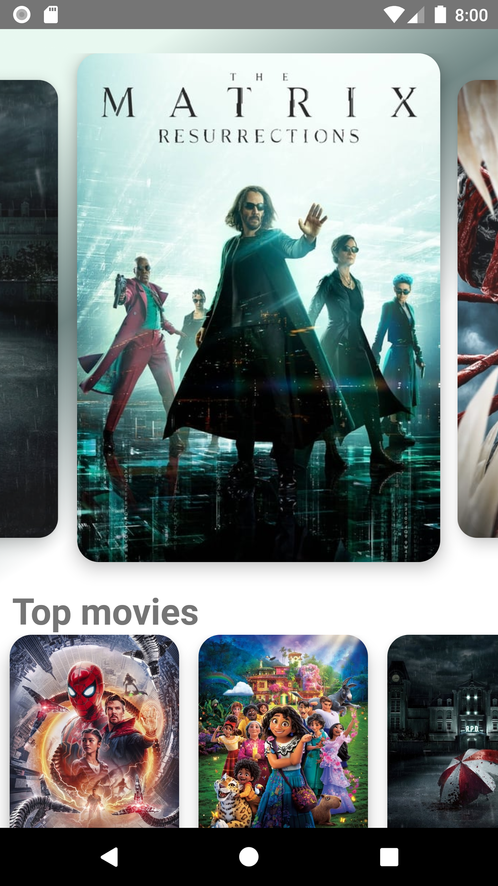
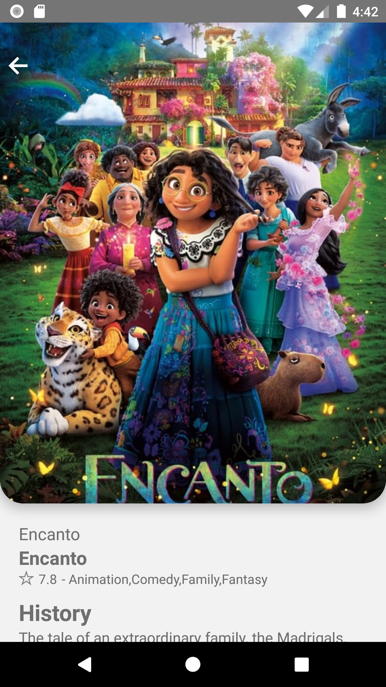
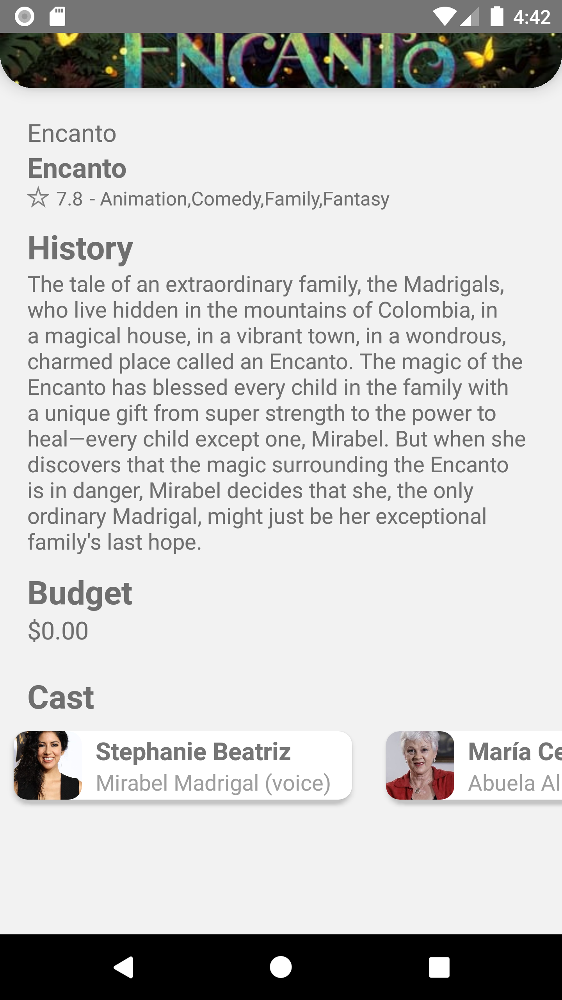

# MoviesAppRN
App build following udemy course for React Native with typescript

- Context
- UseEffect
- Navigation
- Axios
- Promises
- Custom hooks
- Custom components
- Ionicons
- Snap Carousel

## Screenshots

### Home

### Home brackground gradient carnage movie

### Home lists

### Movie detail

### Movie Detail scroll down

